**fyndo** is an enterprise search platform designed to provide intelligent document discovery and knowledge retrieval across organizational data silos. It is powered by AI-driven tag generation and an advanced search module for precise, context-aware results.

---

## Modules

### 1. Tag Generation Agent

**Location:** `agents/tag_generator.py`

**Responsibilities:**  
- Automate extraction of source and semantic content tags from documents (supports S3, PDFs, etc.).
- Use an LLM (e.g., Google Gemini, OpenAI GPT) to generate and score content-relevant tags and produce concise file descriptions.
- Store all tags, scores, and descriptions in MongoDB for fast retrieval.
- Support robust batch workflows, resumable processing, and error handling.

### 2. Intelligent Search Agent

**Location:** `streamlit_app.py`

**Responsibilities:**  
- Provide a modern, user-friendly search experience via Streamlit.
- Allow filtering by source tags (e.g., "github", "notion", etc.) and/or context-aware AI-generated content tags.
- Use an LLM (Google Gemini, OpenAI GPT) to match user queries to content tags and calculate document relevance.
- Return ranked, transparent results with tag and relevance breakdowns.

---

## Flow

1. **Tag Generation**
    - Extract source tags from file path/type.
    - Parse document content, e.g., PDF text extraction.
    - Use an LLM to generate content tags and a summary description.
    - Persist all metadata to MongoDB.

2. **Search**
    - User submits a query and optionally selects source tags.
    - Retrieve relevant docs from MongoDB using these tags.
    - LLM further matches and scores content tags against the user query.
    - Return and display the top-ranked results.

---

## Flow Diagram

```mermaid
flowchart TD
    subgraph TagGeneration
        A[Document in S3 or Upload] --> B[Extract Source Tags and Content: pdfplumber, python-docx, pandas]
        B --> C[LLM Tag and Description Generation: OpenAI or Gemini via LangChain]
        C --> D[Store tags, scores, descriptions in MongoDB]
    end

    subgraph Search
        E[User Query via Streamlit UI] --> F[Fetch relevant docs from MongoDB]
        F --> G[LLM Match Content Tags to Query: OpenAI or Gemini]
        G --> H[Rank and Return Results with Tag and Relevance Breakdown]
        H --> I[Display Results in UI]
    end

    style TagGeneration fill:#f9f,stroke:#333,stroke-width:2px
    style Search fill:#bbf,stroke:#333,stroke-width:2px
```



---

## Technologies Used

- **Python** (core backend)
- **Streamlit** (UI)
- **MongoDB** (metadata and tag storage)
- **Google Gemini LLM** and/or **OpenAI GPT** (tag generation and search intelligence)
- **S3** or similar (document storage)
- **pdfplumber** (for PDF parsing)
- **python-docx** (DOCX parsing)
- **pandas** (data manipulation)
- **LangGraph** (agent workflow orchestration, provides StateGraph)
- **boto3** (AWS S3 access)
- **python-dotenv** (environment variable loading)

---

## Installation & Setup

### 1. Clone the repository

```bash
git clone https://github.com/AI-Mercenary/fyndo.git
cd fyndo
```

### 2. Set up Python virtual environment (recommended)

```bash
python3 -m venv venv
source venv/bin/activate        # On Windows use: venv\Scripts\activate
```

### 3. Install Python Dependencies

Install all required dependencies using pip:

```bash
pip install --upgrade pip
pip install -r requirements.txt
```

### 4. Configure Environment Variables

Copy the example env file and add your credentials:

```bash
cp .env.example .env
# Then, edit .env and set MONGODB_URI, AWS credentials, OPENAI_API_KEY, GEMINI_API_KEY, etc.
```

---

## Usage

### 1. Start MongoDB Server (Windows example)

Open a new terminal and run:

```bash
mkdir C:\data\db                              # Only if directory doesn't exist (Windows)
"C:\Program Files\MongoDB\Server\8.0\bin\mongod.exe" --dbpath C:\data\db
```

> Make sure your MongoDB server is running before using the app.

### 2. Run Tag Generation Agent

```bash
python agents/tag_generator.py
```

### 3. Run Intelligent Search Agent (UI)

```bash
streamlit run streamlit_app.py
```

### 4. Run Mongo Utility Script Directly

```bash
python db\mongo_utils.py
```

---

## requirements.txt

```txt
streamlit
pymongo
boto3
pdfplumber
google-generativeai
openai
langgraph
python-dotenv
langchain-openai
langchain-core
pandas
python-docx
botocore
```

---

## Configuration

- **MongoDB:**  
  Configure your MongoDB connection string as an environment variable, e.g., `MONGODB_URI`.
- **S3:**  
  Set your AWS credentials (or compatible) for document storage.
- **LLM API Keys:**  
  Set your Google Gemini API key (e.g., `GEMINI_API_KEY`) and/or OpenAI API key (e.g., `OPENAI_API_KEY`) as environment variables.

Store sensitive information in a `.env` file or your deployment environment.

---

## References

- [Tag Generation Agent (`agents/tag_generator.py`)](https://github.com/AI-Mercenary/fyndo/blob/main/agents/tag_generator.py)
- [Intelligent Search Agent (`streamlit_app.py`)](https://github.com/AI-Mercenary/fyndo/blob/main/streamlit_app.py)

---
